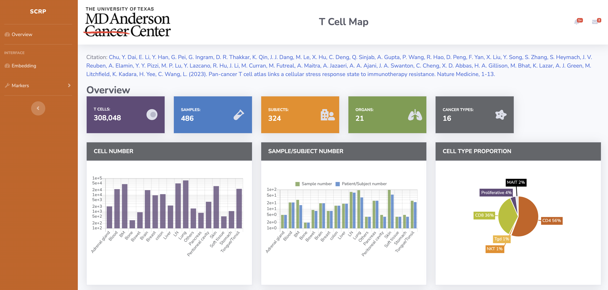
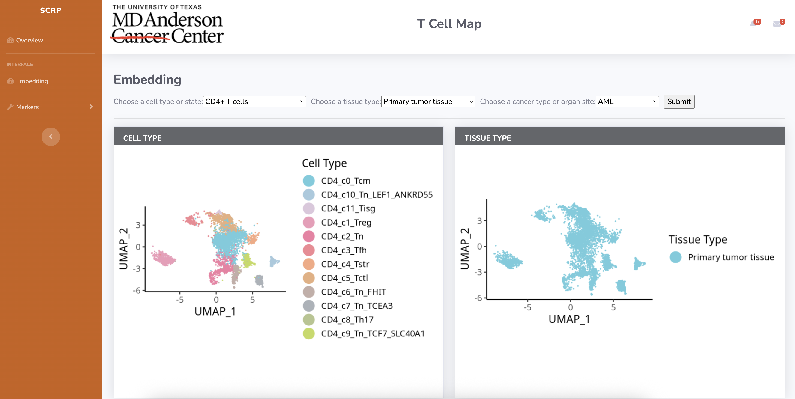
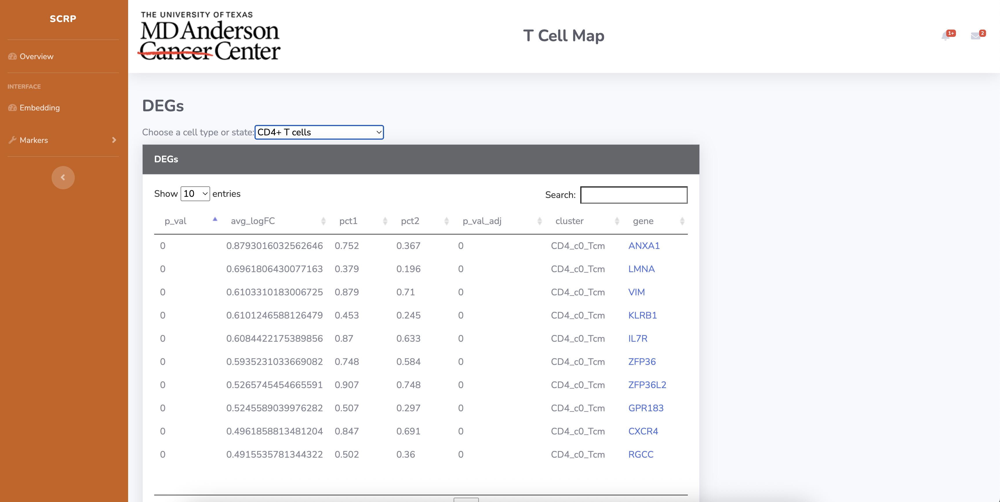

# Tutorial: TCM

This tutorial walks you through the T-Cell Map (TCM) module, showing you how to explore single-cell T-cell data.

## Overview

The T-Cell Map module provides interactive visualization and analysis tools for single-cell T-cell RNA sequencing data. You can explore different T-cell populations, search for gene expression patterns, and analyze differential expression genes.



## Getting Started with TCM

### 1. Navigate to T-Cell Map

1. Open reSCRP in your browser: `https://scrp.breakthroughcancer.org`
2. Click on "TCM" in the navigation menu
3. This opens the T-Cell Map visualization interface

### 2. Explore Cell Types

The main interface shows a UMAP plot with different T-cell populations:



**Key features:**
- **UMAP Plot**: Interactive scatter plot showing cell clusters
- **Cell Type Legend**: Identifies different T-cell populations
- **Color Coding**: Each cell type has a distinct color

**Available Cell Types:**
- **CD4+ T cells** - Helper T cells and their subsets
- **CD8+ T cells** - Cytotoxic T cells and memory populations
- **Regulatory T cells (Tregs)** - Immune suppressor cells
- **T Follicular Helper cells (TFH)** - B cell helper populations
- **Proliferative cells** - Actively dividing T cells
- **Innate-like cells** - NK/MAIT cell populations

### 3. Search for Genes

Use the gene search functionality to explore expression patterns:

**Example genes to try:**
```
CD4      # Helper T cell marker
CD8A     # Cytotoxic T cell marker
FOXP3    # Regulatory T cell marker
GZMB     # Cytotoxic granule marker
IL2      # Cytokine
IFNG     # Interferon gamma
TNF      # Tumor necrosis factor
```

**How to search:**
1. Enter a gene name in the search box
2. View expression levels across cell types
3. Observe spatial expression patterns on the UMAP
4. Compare expression between different conditions

### 4. Analyze Differential Expression Genes (DEGs)

Explore cluster-specific marker genes:



**DEG Analysis Features:**
- **Cluster-specific markers**: Genes that define each cell type
- **Statistical significance**: p-values and fold changes
- **Expression percentages**: How many cells express each gene
- **Interactive tables**: Sort and filter results

**How to use DEGs:**
1. Select a cell cluster of interest
2. View the top marker genes for that cluster
3. Click on genes to see their expression patterns
4. Export results for further analysis
