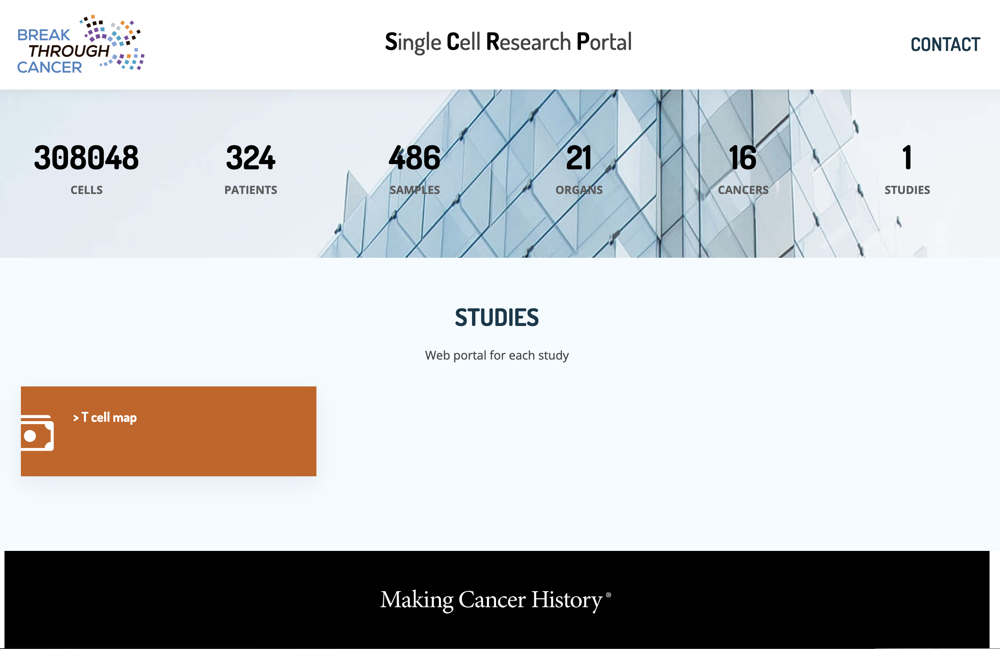

# reSCRP - Single Cell RNA-seq Portal

Welcome to the Break Through Cancer reSCRP (Single Cell RNA-seq Portal) documentation. This platform provides interactive visualization and analysis tools for single-cell RNA sequencing data.

## Overview

reSCRP is a web-based platform designed to:

- **Visualize** single-cell RNA-seq data through interactive plots and charts
- **Explore** Datasets and their molecular characteristics
- **Analyze** gene expression patterns across different cell types
- **Compare** cell populations between different conditions and samples

## Key Features

### 🔍 Data Exploration
- Sample metadata integration
- Interactive UMAP visualizations
- Cell type classification and annotation
- Gene expression search and visualization
- Differential expression gene analysis

## Support

If you encounter issues or have questions:

1. Check the [Troubleshooting](troubleshooting.md) guide
2. Search existing [GitHub Issues](https://github.com/break-through-cancer/reSCRP/issues)
3. Create a new issue with detailed information

## License

This project is developed as part of the Break Through Cancer initiative for advancing cancer research through real-time data sharing and interdisciplinary teamwork to accerlate progress.
